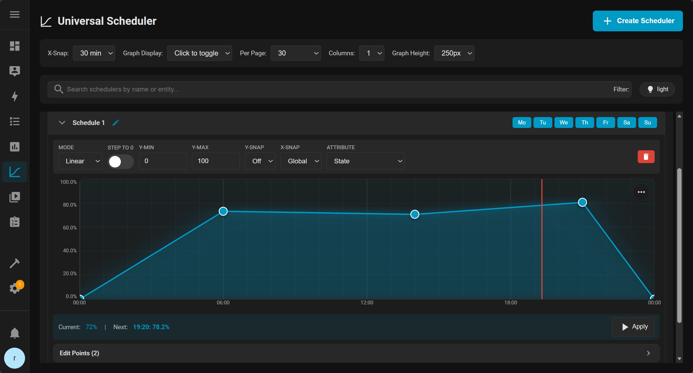

# Universal Scheduler

A Home Assistant integration for creating and managing customizable scheduler curves. This allows you to define complex time-based control patterns for lights, climate systems, and other entities using an interactive graph interface.

## Features

- **Interactive Graph Editor**: Draw scheduler curves with click-to-add points and drag-to-adjust points
- **Multiple Interpolation Modes**:
  - Linear: Straight line between points
  - Smooth: Cosine interpolation for smooth transitions
  - Step: Discrete step values
- **Flexible Control**: Works with:
  - Lights (brightness 0-255)
  - Climate entities (temperature)
  - Number entities (generic numeric values)
- **Real-time Updates**: Automatically applies scheduled values every minute when enabled
- **Custom Y-Axis Range**: Set min and max values for each scheduler

## Installation

1. Copy the `universal_scheduler` folder to `config/custom_components/`
2. Restart Home Assistant or reload custom components
3. Add the integration via UI: Settings → Devices & Services → Create Integration → Universal Scheduler

## Usage

### Creating a Scheduler

1. Go to the Curve Scheduler panel in the sidebar
2. Click **+ Create Scheduler** button
3. Enter a name for your scheduler (e.g., "Living Room Temperature")
4. Configure the scheduler:
   - Select a **Target Entity** to control
   - Choose the **Domain Type** (Light, Climate, Number)
   - Set **Interpolation Mode** (Linear, Smooth, Step)
   - Define the **Y-Axis Range** (Min/Max values)

### Drawing the Curve

1. Click on the graph to add points
2. Drag points to adjust their position
3. Double-click a point to delete it
4. Click **Save Changes** to apply the configuration

### Time Format

- X-axis represents time of day (00:00 to 23:59)
- Times are stored in minutes (0-1440)
- Points are automatically sorted by time

## Architecture

### Files

- `__init__.py`: Integration setup and service registration
- `switch.py`: Switch entity implementation with scheduling logic
- `config_flow.py`: Configuration flow for adding the integration
- `const.py`: Constants and configuration values
- `manifest.json`: Integration metadata
- `services.yaml`: Service definitions
- `strings.json`: Translation strings
- `frontend/panel.js`: Web UI component

### Key Components

#### UniversalSchedulerSwitch
Main entity class that:
- Manages on/off state
- Calculates values based on current time and curve
- Applies values to target entities based on domain type
- Supports state restoration on startup

#### Interpolation Functions
- **Linear**: `y = y1 + (y2 - y1) * t`
- **Smooth (Cosine)**: `y = y1 + (y2 - y1) * (1 - cos(t*π)) / 2`
- **Step**: Returns y1 until reaching p2

## Services

### create_scheduler

Creates a new scheduler curve entity.

**Service data:**
- `name` (string, required): Friendly name for the scheduler
- `entity_id` (string, required): Entity ID (e.g., `switch.my_scheduler`)

### set_schedule_config

Updates scheduler configuration.

**Service data:**
- `entity_id` (string, required): Scheduler entity ID
- `target_entity` (string): Entity to control
- `domain` (string): light, climate, or number
- `mode` (string): Linear, Smooth, or Step
- `min_y` (float): Minimum Y-axis value
- `max_y` (float): Maximum Y-axis value
- `points` (list): Array of {x, y} points

## Examples

### Temperature Scheduler
- Domain: Climate
- Min Y: 16°C
- Max Y: 24°C
- Points: Cool to 16°C at night, warm up to 21°C by morning, maintain 22°C during day, cool to 18°C in evening

### Light Brightness Scheduler
- Domain: Light
- Min Y: 0% (off)
- Max Y: 100% (full brightness)
- Mode: Smooth (for comfortable transitions)
- Points: Off during night, gradually brighten in morning, maintain high during day, dim in evening

## Troubleshooting

### Scheduler not applying values
- Ensure the scheduler switch is turned ON
- Check that the target entity is correctly configured
- Verify the domain type matches the target entity

### Graph not showing
- Hard refresh the browser (Ctrl+Shift+R or Cmd+Shift+R)
- Check browser console for JavaScript errors
- Ensure the frontend panel is properly loaded

### Values not updating
- Check Home Assistant logs for errors
- Ensure the scheduler is enabled (switch is ON)
- Verify the target entity exists and accepts the service calls
